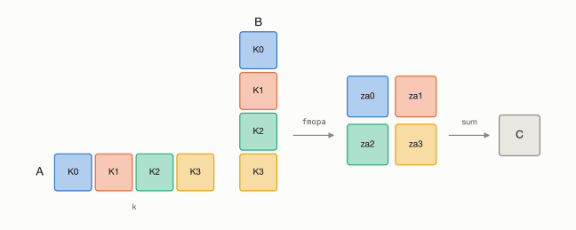
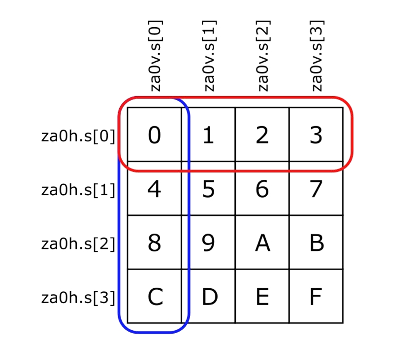
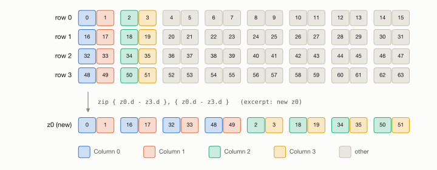
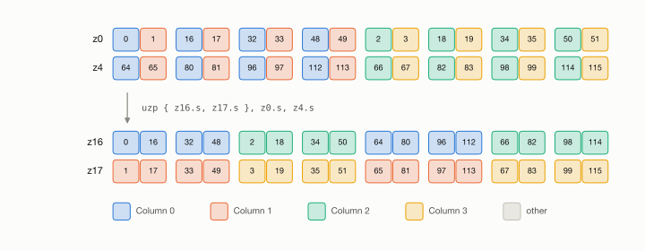
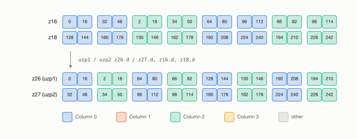
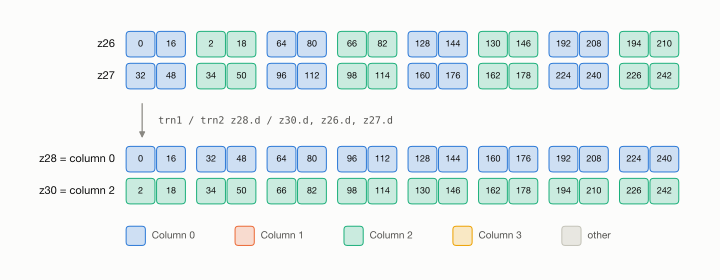

Group Specific Component
========================

.. toctree::
   :maxdepth: 2

Optimized JIT for GEMM for any input sizes and transposed inputs and outputs
----------------------------------------------------------------------------

Goal
^^^^

The goal of our group specific component is a JIT kernel generator which creates optimized assembly code
for the GEMM :math:`C \mathrel{+}= AB` with arbitrary sizes :math:`M`, :math:`N`, :math:`K`
and with transposed and non-transposed inputs :math:`A`, :math:`B` and output :math:`C`.

The GEMM generator of week 6 was the starting point for the group specific component.
It only supported a single memory layout (FP32, column-major :math:`A` and :math:`C`, row-major :math:`B`)
and sizes :math:`M`, :math:`N`, :math:`K` which are multiples of 16; for all other inputs, the generation failed with an error.
For :math:`M = N = K = 512`, the week 6 generator reaches 1774 GFLOPS.
Within the group specific component, the generator was extended to support arbitrary sizes and all combinations of transposed inputs and outputs.

On the Apple M4 the streaming vector length (SVL) is 512 bit, so a Z register holds 16 FP32 values
and the ZA array provides four FP32 tiles ``za0`` to ``za3`` with :math:`16 \times 16` elements each.
One ``fmopa`` instruction computes the outer product of an :math:`M`-vector of :math:`A` and an :math:`N`-vector of :math:`B`
and accumulates it into one tile.
The block of :math:`C` that is kept in the four tiles is chosen depending on the sizes of the input matrices:

* :math:`M \geq 32` and :math:`N \geq 32`: the tiles are arranged as :math:`2 \times 2` tiles, i.e., a :math:`32 \times 32` block of :math:`C`.
  In every :math:`k` step, two vectors (32 values) of :math:`A` and two vectors of :math:`B` are loaded,
  so four loads feed four ``fmopa`` instructions.

  .. figure:: graphics/4x4.jpeg
     :width: 300px
     :align: center

     Four ZA tiles as :math:`2 \times 2` block of :math:`C`.

* :math:`M \geq 32` or :math:`N \geq 32` while the other dimension is at most 16: the tiles are arranged as :math:`1 \times 4` tiles.
  In every :math:`k` step, four vectors of the larger dimension and one vector of the smaller dimension are loaded,
  so five loads feed four ``fmopa`` instructions.

  .. figure:: graphics/1x4.jpeg
     :width: 400px
     :align: center

     Four ZA tiles as :math:`1 \times 4` block of :math:`C`.

* :math:`M \leq 16` and :math:`N \leq 16`: the whole block of :math:`C` fits into a single tile.
  To use the remaining three tiles, the :math:`K` dimension is split into multiple K-tiles which are accumulated in different tiles
  and summed up at the end (see `Multiple K-Tiles`_).

  .. figure:: graphics/+4.jpeg
     :width: 300px
     :align: center

     Four ZA tiles holding partial sums of the same block of :math:`C`.

Approach
^^^^^^^^

Before extending the generator, we implemented and benchmarked the new building blocks as hand-written assembly kernels
in the ``benchmarks`` directory:

* the summation of multiple K-tiles for small :math:`M` and :math:`N`,
* different strategies to transpose the input matrices,

All benchmarks were run single-threaded on an Apple M4.
The GEMM kernels are verified against a C++ reference implementation before they are benchmarked.
The GEMM benchmarks are built and run with the following commands:

.. code-block:: bash

   cd benchmarks/gemm
   mkdir -p build
   cd build
   /opt/homebrew/opt/cmake/bin/cmake -D CMAKE_C_COMPILER=/opt/homebrew/opt/llvm/bin/clang -D CMAKE_CXX_COMPILER=/opt/homebrew/opt/llvm/bin/clang++ ..
   /opt/homebrew/opt/cmake/bin/cmake --build .
   ./gemm_benchmarks_driver_16_16

The driver first prints the maximum absolute difference to the reference implementation and the verification result (``1`` means passed)
for every kernel and then one line with the measured GFLOPS per kernel.

Multiple K-Tiles
^^^^^^^^^^^^^^^^

If :math:`M` and :math:`N` are at most 16, the block of :math:`C` fits into a single ZA tile.
If all ``fmopa`` instructions accumulate into the same tile, every instruction depends on the result of the previous one
and the other three tiles stay unused.
The idea is to use the other tiles for additional K-tiles:
the kernel ``benchmarks/gemm/gemm_16_16_multiple_k.s`` unrolls the K loop by four and accumulates
the :math:`k` steps :math:`4i + t` in tile ``za<t>``.
This way, the four tiles are computed independently of each other.
:math:`C` is loaded into ``za0`` only, the other tiles start at zero because ``smstart`` zeroes the ZA array.
After the K loop, the four partial results have to be summed up, see the figure below.

   The K-tiles of :math:`A` and :math:`B` are accumulated in different ZA tiles, which are summed up to obtain :math:`C`.

The straightforward approach is to move the same rows of every tile into Z registers and to sum them up with ``fadd``.
For example, the first row of every tile is moved into a different Z register and the four registers are summed up in one Z register.
One multi-vector ``mova`` instruction moves four rows at a time.
This approach leads to the code below.

.. code-block:: gas
   :linenos:

   .rept 4
   mova { z0.s - z3.s }, za0h.s[w13, 0:3]
   mova { z4.s - z7.s }, za1h.s[w13, 0:3]
   mova { z8.s - z11.s }, za2h.s[w13, 0:3]
   mova { z12.s - z15.s }, za3h.s[w13, 0:3]
   fadd z0.s, z0.s, z4.s
   fadd z1.s, z1.s, z5.s
   fadd z2.s, z2.s, z6.s
   fadd z3.s, z3.s, z7.s
   fadd z0.s, z0.s, z8.s
   fadd z1.s, z1.s, z9.s
   fadd z2.s, z2.s, z10.s
   fadd z3.s, z3.s, z11.s
   fadd z0.s, z0.s, z12.s
   fadd z1.s, z1.s, z13.s
   fadd z2.s, z2.s, z14.s
   fadd z3.s, z3.s, z15.s
   st1w  {z0.s - z3.s}, pn8, [x6]
   add w13, w13, #4
   add x6, x6, x10, lsl #2
   .endr

The benchmark results for :math:`M = N = 16` and :math:`K = 512` are shown in the table below.
Using all four ZA tiles results in a speedup of 2.43 over the kernel with a single K-tile (``gemm_16_16_ref_single_k.s``).

.. list-table::
   :header-rows: 1

   * - Kernel
     - GFLOPS
   * - 1 K-tile
     - 478.8
   * - 4 K-tiles
     - 1164.2

Further optimizations are possible through the usage of SME2 instructions.
The instruction ``fadd za.s[w8, 0, VGx4], {z4.s - z7.s}`` adds four Z registers to four vectors of the ZA array.
The four vectors are selected with a stride.
For an SVL of 512 bit, the ZA array consists of :math:`\text{SVL} / 8 = 64` vectors,
and the stride is :math:`64 / 4 = 16` for groups of four vectors.
The first selected vector is :math:`(\texttt{w8} + \text{offset}) \bmod 16`, the next ones follow at a distance of 16.
For 32-bit elements, the ZA array vector :math:`4i + t` is the horizontal slice :math:`i` of tile ``za<t>``.
Thus, the offset selects the tile and ``w8`` selects the slices.
The table below shows the written ZA array vectors depending on ``w8`` for offset 0:

.. list-table::
   :header-rows: 1

   * - ``w8``
     - ZA array vectors
     - ``za0h.s`` slices
   * - 0
     - 0, 16, 32, 48
     - 0, 4, 8, 12
   * - 4
     - 4, 20, 36, 52
     - 1, 5, 9, 13
   * - 8
     - 8, 24, 40, 56
     - 2, 6, 10, 14
   * - 12
     - 12, 28, 44, 60
     - 3, 7, 11, 15

See the `Arm A64 instruction set documentation <https://support.arm.com/documentation/ddi0602/2022-09/SME-Instructions/ADD--array-accumulators---Add-multi-vector-to-ZA-array-vector-accumulators->`_
of the multi-vector add to ZA array instructions for details.

The following code (``benchmarks/gemm/gemm_16_16_multiple_k_v2.s``) uses this instruction to add the K-tiles.
With offsets 1, 2 and 3, ``mova`` reads the same slices of ``za1``, ``za2`` and ``za3`` which are then added to ``za0``.
Afterwards, the result is stored directly from the horizontal slices of ``za0``.

.. code-block:: gas
   :linenos:

   .rept 4
   mova { z0.s - z3.s }, za.s[w8, 1 , VGx4]
   fadd za.s[w8,0,VGx4], {z0.s - z3.s}

   mova { z4.s - z7.s }, za.s[w8, 2 , VGx4]
   fadd za.s[w8,0,VGx4], {z4.s - z7.s}

   mova { z8.s - z11.s }, za.s[w8, 3 , VGx4]
   fadd za.s[w8,0,VGx4], {z8.s - z11.s}
   add w8, w8, #4;
   .endr

The benchmark gives the following results:

.. list-table::
   :header-rows: 1

   * - Kernel
     - GFLOPS
   * - 1 K-tile
     - 478.8
   * - 4 K-tiles
     - 1164.2
   * - 4 K-tiles, SME2
     - 1261.7

The SME2 instructions increase the throughput by another 8%.
The speedup probably comes from the fact that only three instead of four ``mova`` instructions are needed per group of rows,
because the addition takes place in the ZA array instead of the Z registers.

Transposing
^^^^^^^^^^^

``fmopa`` needs the :math:`M`-values of :math:`A` for a fixed :math:`k` in one vector.
If :math:`A` is transposed, i.e., stored with the :math:`K` dimension contiguous in memory,
these values are strided in memory and the input has to be transposed in blocks of :math:`16 \times 16` values on the fly.
We explored three strategies to transpose the input matrices:

* ZA array
* SME2 instructions
* TBL instructions

ZA-Array
""""""""

The ZA array can be used to transpose the input matrices.
The input is loaded in one orientation, for example into the horizontal slices of a tile,
and then read in the other orientation from the vertical slices, see the code and the figure below.

.. code-block:: none
   :linenos:

   mov w12, #0
   .rept 16
   ld1w za0h.s[w12, 0], p0/z, [x0]
   add x0, x0, x2, LSL #2
   add w12, w12, #1
   .endr

   mov w12, #0
   .rept 16
   st1w za0v.s[w12, 0], p0, [x1]
   add x1, x1, x3, LSL #2
   add w12, w12, #1
   .endr

   A row of the input is written to a horizontal slice (red), a column is read from a vertical slice (blue).

SME2
""""

In a GEMM kernel, the ZA array is used for the matrix multiplication.
Using it to transpose the input matrix means that the current state of the tile has to be moved out of the tile,
for example into Z registers or onto the stack.
Then the input can be transposed and afterwards the state of the tile has to be restored for the next ``fmopa`` instructions.
For this reason, it might be beneficial not to use the ZA array for transposing.
The following sequence of SME2 instructions provides an alternative which transposes the data in the Z registers.
Registers ``z0`` to ``z15`` hold the 16 rows of a :math:`16 \times 16` block.
The sequence computes the first four columns of the block in ``z28`` to ``z31``:

.. code-block:: gas
   :linenos:

   zip { z0.d - z3.d }, { z0.d - z3.d }
   zip { z4.d - z7.d }, { z4.d - z7.d }
   zip { z8.d - z11.d }, { z8.d - z11.d }
   zip { z12.d - z15.d }, { z12.d - z15.d }

   uzp { z16.s, z17.s}, z0.s, z4.s
   uzp { z18.s, z19.s}, z8.s, z12.s

   uzp1 z26.d, z16.d, z18.d
   uzp2 z27.d, z16.d, z18.d

   trn1 z28.d, z26.d, z27.d
   trn2 z30.d, z26.d, z27.d

   uzp1 z26.d, z17.d, z19.d
   uzp2 z27.d, z17.d, z19.d

   trn1 z29.d, z26.d, z27.d
   trn2 z31.d, z26.d, z27.d

   st1w { z28.s - z31.s }, pn8, [x1]

The following figures show the steps for columns 0 to 3.
The numbers are the positions of the values in the input block, i.e., value :math:`16r + c` is the value in row :math:`r` and column :math:`c`.

   Step 1: ``zip`` on four registers interleaves their 64-bit elements.

``zip`` roughly pre-sorts the column values:
after this step, columns 0 and 1 of rows 0 to 3 are in the lower half and columns 2 and 3 in the upper half of ``z0``,
but still as interleaved 64-bit pairs.
Accordingly, ``z1`` to ``z3`` hold columns 4 to 15 of rows 0 to 3.

   Step 2: ``uzp`` on 32-bit elements separates the even from the odd columns.

The multi-register ``uzp`` on 32-bit elements separates the even from the odd columns:
columns 0 and 2 end up in ``z16``, columns 1 and 3 in ``z17``.
The same happens in parallel for rows 8 to 15 (``z18`` and ``z19``).

   Step 3: ``uzp1`` and ``uzp2`` on 64-bit elements merge the upper and the lower half of the block.

``uzp1`` and ``uzp2`` on 64-bit elements merge the upper and the lower half of the block
and distribute the pairs such that ``z26`` and ``z27`` only contain columns 0 and 2 in regular alternation.

   Step 4: ``trn1`` and ``trn2`` on 64-bit elements separate the columns.

``trn1`` and ``trn2`` on 64-bit elements finally separate the columns:
``z28`` contains column 0 and ``z30`` column 2.
Analogously, ``z17`` and ``z19`` yield ``z29`` (column 1) and ``z31`` (column 3) in the same way.
In the GEMM kernel ``benchmarks/gemm/gemm_16_16_trSME_mk.s``, the four ``zip`` instructions are executed once per :math:`16 \times 16` block.
The remaining steps are repeated with the registers ``z1``, ``z5``, ``z9``, ``z13`` (columns 4 to 7) and so on,
so the whole block is transposed without using the ZA array.

TBL
"""

Transpose Benchmarks
""""""""""""""""""""

First, the transposition of a single :math:`16 \times 16` block is benchmarked on its own.
To exclude the overhead of ``smstart`` and ``smstop``, each kernel transposes the block 50000 times in a loop.
The bandwidth counts the read and the written bytes.
The benchmark is built and run with the following commands:

.. code-block:: bash

   cd benchmarks/transpose_kLoop
   mkdir -p build
   cd build
   /opt/homebrew/opt/cmake/bin/cmake -D CMAKE_C_COMPILER=/opt/homebrew/opt/llvm/bin/clang -D CMAKE_CXX_COMPILER=/opt/homebrew/opt/llvm/bin/clang++ ..
   /opt/homebrew/opt/cmake/bin/cmake --build .
   ./transpose_kloop_benchmarks_driver

The driver prints one line per kernel in the following order:
a plain copy (called once per repetition, so not comparable to the other lines), ZA array, TBL, TBL v2 and SME2.
The table lists the TBL v2 result for TBL.

.. list-table:: Transposition of a :math:`16 \times 16` block
   :header-rows: 1

   * - Strategy
     - GiB/s
   * - ZA array
     - 277.7
   * - TBL
     - 105.5
   * - SME2
     - 111.9

On its own, the transposition through the ZA array is 2.5 times faster than the other two strategies.

Second, the transpositions were integrated into GEMM kernels with transposed :math:`A` and benchmarked with ``gemm_benchmarks_driver_16_16`` (see `Approach`_).
The :math:`16 \times 16 \times 512` kernels are based on the kernel with four K-tiles and the SME2 summation.
The ZA variant saves ``za0`` in ``z16`` to ``z31`` while it uses the tile for the transposition.
The :math:`512 \times 512 \times 512` kernels use the :math:`2 \times 2` tiles, i.e., all four tiles hold accumulators.
Therefore, the ZA variant spills ``za0`` to a buffer on the stack for every block of 16 :math:`k` steps.
The kernel aligns this buffer to 64 bytes.
Without the alignment, the performance of the ZA variant depended on the stack position of the caller:
if the buffer was not aligned, every spilled vector crossed two cache lines and the kernel dropped from about 650 to 559 GFLOPS.
The kernels without transposition are the 4 K-tile kernel of the previous section
and the kernel of the current JIT generator (see ``docs/src/weeks/data/week06_gemm_layouts.tsv``).

.. list-table:: GEMM kernels with transposed :math:`A`
   :header-rows: 1

   * - Kernel
     - GFLOPS
   * - :math:`16 \times 16 \times 512`, 4 K-tiles, no transposition
     - 1261.7
   * - :math:`16 \times 16 \times 512`, 4 K-tiles, transposition: ZA array
     - 482.6
   * - :math:`16 \times 16 \times 512`, 4 K-tiles, transposition: SME2
     - 472.7
   * - :math:`512 \times 512 \times 512`, JIT generator, no transposition
     - 1837.6
   * - :math:`512 \times 512 \times 512`, transposition: ZA array
     - 647.4
   * - :math:`512 \times 512 \times 512`, transposition: SME2
     - 624.4

The transposition with the ZA array is the fastest in both cases, although the state of the tile has to be saved and restored.
However, most of its advantage disappears inside the GEMM kernels:
for :math:`16 \times 16 \times 512`, where ``za0`` can be kept in Z registers, the ZA array is 2% faster than the SME2 instructions,
for :math:`512 \times 512 \times 512`, where ``za0`` has to be spilled to the stack, it is 4% faster.
Both strategies are still far slower than the kernels without transposition.

Jitter
^^^^^^

Conclusion
^^^^^^^^^^

* Using all four ZA tiles for independent K-tiles increases the performance of small GEMMs with :math:`M, N \leq 16` by a factor of 2.43.
  Summing up the K-tiles with the SME2 multi-vector ``fadd`` into the ZA array increases it by another 8%, to 1261.7 GFLOPS.
* The ZA array is the fastest way to transpose the input, on its own (2.5 times faster) as well as inside the GEMM kernels,
  although the accumulator tile has to be saved and restored.
  Inside the GEMM kernels, the advantage shrinks to 2% to 4% compared to the SME2 instructions.
* If the accumulator tile is spilled to the stack, the spill buffer has to be aligned to 64 bytes;
  otherwise, the performance depends on the stack position of the caller.
* A transposed :math:`A` remains expensive: the best kernels with transposed :math:`A` reach 38% (small) and 35% (large)
  of the performance of the corresponding kernels without transposition.

Further Optimizations
^^^^^^^^^^^^^^^^^^^^^

* Since the SME2 instructions do not touch the ZA array, they avoid saving and restoring the accumulator tile
  and may be the better choice when more than one input has to be transposed.
* The :math:`512 \times 512 \times 512` kernels transpose the same block of :math:`A` again for every block of :math:`N`.
  Transposing :math:`A` once into a buffer and reusing it for all blocks of :math:`N` could improve performance.
