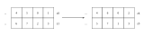

Week 3/4
===========

.. toctree::
   :maxdepth: 2

In the third and fourth week we implemented the ``identity``, ``zero`` and ``relu`` unary primitives
on 16x16 FP32 matrices.
Furthermore we implemented FP32 SME microkernels for matrix-matrix multiplications.
Finally we determined the performance for all of the mentioned kernels.

Unary Primitives
------------------

Identity 
^^^^^^^^^

The ``identity`` operation copies the contents of the 16x16 matrix A
to the 16x16 matrix B. The matrix may optionally be transposed in the process if requested. 

If no transpose is requested, performing the identity operations simply
involves copying all of the data from A to B.
We chose to implement the nontransposing identity operation using 
load- and store-instructions into general purpose registers instead of 
the SSVE registers.

Our implementation for a transposing ``identity`` relies on the fact, that
the following two commands may be used to transpose 2x2 FP32 matrices stored 
in the registers ``z0`` and ``z1``::

    trn1 z4.s, z0.s, z1.s
    trn2 z5.s, z0.s, z1.s

    Transposition of multiple 2x2 matrices.

This method may be used in order to transpose a 4x4 matrix.
First we transpose each of the 2x2 submatrices located in the corners of the
input matrix.
Then we use the following instructions to transpose the higher-level 
2x2 matrix of submatrices::

    trn1 z0.d, z4.d, z6.d
    trn1 z1.d, z5.d, z7.d
    trn2 z2.d, z4.d, z6.d
    trn2 z3.d, z5.d, z7.d

In that manner we implemented a 4x4 version of the ``identity`` operation.
The full 16x16 transpose is then implemented by splitting the input matrix up
into a 4x4 matrix of submatrices of size 4x4.
Each submatrix is transposed using the above process and then stored at it's
respective location.

Zero 
^^^^^^^^^

The zero operation simply fills the target 16x16 matrix with zeroes.
Our implementation is an unrolled version of a simple loop performing
this process using load- and store-instructions into general purpose registers
and does not make use of SSVE instructions.

Relu 
^^^^^^^^^

The RELU operation copies the input 16x16 matrix to the target matrix while 
setting all negative entries to zero.
Furthermore the output matrix may optionally be transposed in the process.

Our first implementation copied the input matrix to the output matrix using our 16x16
``identity`` operation and afterwards set the negative entries of the output matrix to zero
in a second pass. This moved every element twice: once for the copy and once more for the
maximum. Since the kernel is limited by memory bandwidth and not by arithmetic, the second
pass roughly doubled its runtime.

The current implementation therefore performs the operation in a single pass. Each row is
loaded into a vector register, the maximum is applied while the data is still in the register,
and the result is written to the output matrix::

    ld1w z0.s, p0/z, [x0]
    fmax z0.s, p0/m, z0.s, #0.0
    st1w z0.s, p0, [x1]

If a transposed output is requested, the transposition is performed through the ZA tile.
Each row is loaded into a vector register, the ``fmax`` is applied, and the row is then moved
into a horizontal slice of ``za0.s``. Afterwards the vertical slices of the tile are written
to the output matrix, which yields the transposed result.
In this case one additional register-to-register move per row is unavoidable, because
``fmax`` operates on vector registers while the transposition requires the data to pass
through the ZA tile.

In the transposing case four rows are loaded and processed per loop iteration.

GEMM
----

We implemented a General Matrix Multiply (GEMM) operation that computes :math:`C \leftarrow C + A \times B`.
The GEMM implementation was developed incrementally, starting from a small microkernel 
and scaling up to a full matrix multiplication using a block-based tiling approach.

The 32x32 Microkernel
^^^^^^^^^^^^^^^^^^^^^

The core of our GEMM implementation is a 32x32 microkernel. Since the SME ZA array is partitioned 
into four 32-bit tiles (``za0.s`` to ``za3.s``) for FP32 operations, a 32x32 matrix exactly 
fills the entire ZA array.

Scaling the K-Dimension
^^^^^^^^^^^^^^^^^^^^^^^

For the ``gemm_32_32_512`` kernel, we wrapped the outer product computation in a loop 
over the K-dimension. The C matrix is loaded into the ZA array once, followed by 512 iterations 
where vectors of A and B are loaded and accumulated via ``fmopa``.

Tiling over M and N
^^^^^^^^^^^^^^^^^^^

We iterate over the N and M dimensions of the global matrix in steps of 32. 
In each iteration, we calculate the appropriate memory offsets using the leading dimensions 
(``ld_a``, ``ld_b``, ``ld_c``) to isolate a specific 32x32 block of C. We then execute the K-loop 
to compute the partial results for this specific tile.

Verification
------------

All kernels of this week are tested with `Catch2 <https://github.com/catchorg/Catch2>`_.
The tests are registered with CTest and are executed by ``ctest`` together with the tests
of the other weeks.

The unary kernels are tested in ``sme/unary_tests.cpp`` against the reference implementations
in ``common/mlc_common.hpp``. Besides the dense 16x16 case, each kernel is also applied to a
16x16 submatrix of a 512x512 matrix. These tests verify that a kernel writes its own submatrix
only and does not touch the surrounding elements.

The GEMM kernels are tested in ``sme/gemm_tests.cpp``. Every kernel is executed on random
matrices and compared against the reference GEMM ``gemm_ref``, which accumulates in ``double``.
The comparison uses a relative tolerance of :math:`10^{-4}`, since the kernels accumulate in FP32.

Writing these tests uncovered two problems in ``gemm_16_16``:

* The kernel did not execute ``smstart``, so calling it from a driver raised an illegal
  instruction exception.
* The register ``x12`` was used both for the scaled leading dimension of B and as the ZA tile
  selector, so the stride was overwritten before the K loop used it. The kernel produced
  correct results only because the overwritten value happened to match the stride of a
  densely stored B with :math:`n = 16`. The leading dimension of B is now kept in ``x17``.

The tests also document a limitation of the kernels of this week. They are written for fixed
matrix shapes and derive their loop bounds from the leading dimensions, which requires A and B
to be stored densely (:math:`ld_a = m`, :math:`ld_b = n`). Only ``gemm_512_32_512`` supports a
leading dimension of C larger than :math:`m`. The code generator of week 6 does not have this
restriction.

Benchmarks
----------

Unary Primitives
^^^^^^^^^^^^^^^^

We determine the performance of our implementations, by repeatedly executing
a given kernel on a contiguous 16x16 FP32 input matrix and a contiguous 16x16 FP32 
output matrix while measuring the time taken ``t`` for all repetitions.
If we let ``s`` be the total number of bytes processed by the kernel, then we
determine the number of bytes processed per second ``v`` as follows::

    v = s / t

The following results were obtained on the ``edward.inf-ra.uni-jena.de`` machine with our
first implementation, in which the transposing kernels and the ``relu`` kernel moved the
data twice:

* ``identity``: 35.3 GiBs
* transposing ``identity``: 1.05 GiBs
* ``zero``: 65.49 GiBs
* ``relu``: 1.55 GiBs
* transposing ``relu``: 0.99 GiBs

After rewriting the transposing kernels to use the ZA tile and the ``relu`` kernel to apply
``fmax`` in a single pass, we measured the current implementation on an Apple M4:

.. list-table::
   :header-rows: 1

   * - Kernel
     - GiB/s
   * - ``identity``
     - 8.21
   * - transposing ``identity``
     - 10.66
   * - ``zero``
     - 16.58
   * - ``relu``
     - 11.12
   * - transposing ``relu``
     - 10.01

The two machines cannot be compared directly, so the absolute values differ from the
measurements above. What the rewrite changed is the relation between the kernels:
in the first implementation the transposing kernels and ``relu`` were more than an order of
magnitude slower than ``identity``, while they now all achieve a comparable bandwidth.

All of these kernels operate on a single 16x16 matrix, which is only 1 KiB of data.
Each call therefore enters and leaves streaming mode with ``smstart`` and ``smstop``,
and the cost of these two instructions dominates the measurement.
This is the reason why the values are far below the bandwidth reached by the generated
kernels of week 6, which process much larger matrices per call.

GEMM
^^^^^^^^^^^^^^^^

We determine the GFLOPS of our GEMM kernels as follows:

.. code-block:: c++

   double flops_per_call = 2.0 * M * N * K;
   double total_flops = flops_per_call * num_iterations;
   double gflops = (total_flops / 1e9) / duration;

When executing our benchmarks on the ``edward.inf-ra.uni-jena.de`` machine,
we obtain the following results:

* ``gemm_kernel_32_32_1``: 50.498 GFLOPS
* ``gemm_kernel_32_32_512``: 1824.63 GFLOPS
* ``gemm_kernel_512_32_512``: 1821.79 GFLOPS
* ``gemm_kernel_512_512_512``: 1802.76 GFLOPS

