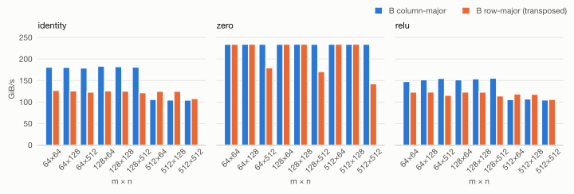
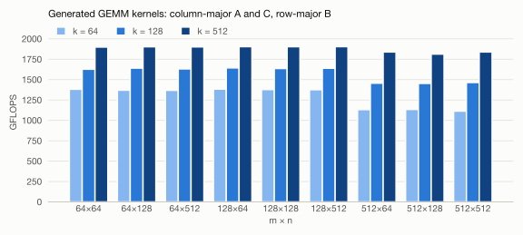
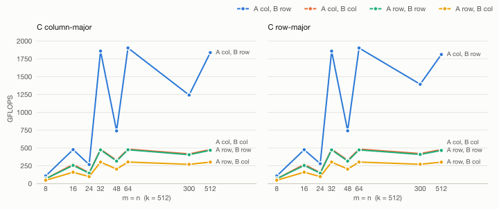

Week 6
===========

.. toctree::
   :maxdepth: 2

In the sixth week we implemented a code generator to instantiate the unary and GEMM primitives.
We determined the performance for the instantiated primitives for different input sizes.

Unary Primitives
----------------

We implemented a code generator to instantiate the ``identity``, ``zero`` and ``relu`` primitives.
The matrix dimensions ``m`` and ``n``, the data type of the stored elements and the storage format of
the output matrix are passed to the code generator when instantiating the primitives.
The actual matrix pointers and stride information are passed when calling the generated kernel.
Currently code generation is only supported for primitives operating on matrices containing
32-bit floating point values.

Our code generator splits the input matrices into square submatrices of size 16x16.
It generates a microkernel to perform the desired operation on a 16x16 matrix.
The full kernel loops over the input matrices' tiles, executing the microkernel on each.

GEMM
----------------

The GEMM generator creates a kernel for :math:`C \mathrel{+}= A B` from the parameters
``m``, ``n``, ``k``, ``trans_a``, ``trans_b`` and ``trans_c``.
The flags select column-major (``0``) or row-major (``1``) storage for each matrix,
the leading dimensions are passed when the kernel is called.
Beyond the task, which only requires multiples of 16 for ``m`` and ``n``, the generator supports
arbitrary sizes of all three dimensions and all eight combinations of storage formats.
Only FP32 is supported.

.. note::

   This section describes the current state of the generator.
   At the end of week 6, the generator only supported column-major A and C, row-major B
   (``trans_a = 0``, ``trans_b = 1``, ``trans_c = 0``) and sizes ``m``, ``n``, ``k`` which are multiples of 16.
   The support for arbitrary sizes, all storage formats and the in-register transposition
   was added later as part of the :doc:`group specific component <group_specific>`.
   The verification and the benchmarks below use the current generator.

Verification
^^^^^^^^^^^^

The tests in ``code_gen/gemm_tests.cpp`` use Catch2 and compare every generated kernel against a
reference implementation, for all eight storage formats:

* all sizes :math:`m, n, k \in \{32, 64, 96, 128, 160\}`,
* all sizes :math:`m, n, k \in \{8, 16, \ldots, 96\}`, which exercise the predicated microkernel,
* odd sizes :math:`m, n, k \in \{1, 7, 13, 17, 33, 50\}`, which combine all three tile kinds with
  predicated remainders of ``k``,
* the 27 settings of the task, :math:`m, n, k \in \{64, 128, 512\}`.

The results are compared with a relative tolerance of :math:`10^{-4}`, since the kernel and the
reference accumulate the FP32 products in a different order.

Benchmarks
-----------------

Unary Primitives
^^^^^^^^^^^^^^^^^

For each primitive we generated a kernel for every combination of
:math:`m, n \in \{64, 128, 512\}` and both storage formats of B,
and executed it repeatedly until 300 GiB had been processed.
The bandwidth counts the size of the matrix once per call.
Since single runs varied by up to a factor of four on the M4, each setting was measured three times
and the figure shows the best run. All values are available
:download:`as a table <data/week06_unary.tsv>`.

    Bandwidth of the generated unary kernels.

* ``zero`` reaches about 234 GiB/s in almost all settings. It only writes to memory and
  does not load anything.
* ``identity`` and ``relu`` with column-major B reach 179 to 183 GiB/s and 148 to 156 GiB/s
  for :math:`m \le 128`. For :math:`m = 512` both drop to about 105 GiB/s.
* The transposing kernels reach 114 to 127 GiB/s. The additional pass through the ZA tile costs
  about a third of the bandwidth for small matrices, while for :math:`m = 512` both storage formats
  perform alike.

The drop for :math:`m = 512` is most likely caused by the access pattern: A and B are stored densely,
so the leading dimension equals ``m``. A 16×16 tile then spans 16 columns that lie 2 KiB apart
instead of 256 or 512 bytes, so every tile touches more cache lines and pages.
The same pattern appears for ``zero`` with row-major B and :math:`n = 512` (142 to 180 GiB/s),
where the stores of a tile are 2 KiB apart.

GEMM
^^^^^^^^^^^^^^^^^

Each GEMM kernel was executed repeatedly until 4000 GFLOP had been computed,
after a warm-up of a quarter of that. The results are available
:download:`as a table <data/week06_gemm_task.tsv>`.

    Performance of the generated GEMM kernels for the 27 settings of the task.

The size of ``k`` has by far the largest influence on the performance:

.. list-table::
   :header-rows: 1

   * - :math:`k`
     - GFLOPS
   * - 64
     - 1113 to 1383
   * - 128
     - 1453 to 1643
   * - 512
     - 1812 to 1904

For every tile of C the microkernel loads the tile into ZA and stores it back once, while the
work of the tile grows linearly with ``k``. For :math:`k = 64` a 32×32 tile performs 256 ``fmopa``
instructions against 64 loads and 64 stores of ZA rows, for :math:`k = 512` it performs 2048.
The fixed cost of every call, the prologue and ``smstart`` / ``smstop``, is amortized in the same way.

``m`` and ``n`` hardly matter, with one exception: for :math:`m = 512` the kernels are about 17% slower
at :math:`k = 64` (1113 to 1134 GFLOPS instead of 1360 to 1383), while at :math:`k = 512` the difference
disappears. Since the penalty shrinks exactly as the share of time spent on loading and storing C shrinks,
it is most likely caused by C: with :math:`ld_c = 512` the rows of a C tile lie 2 KiB apart.

Storage formats and tile kinds
^^^^^^^^^^^^^^^^^^^^^^^^^^^^^^

To see the effect of the storage formats and of the three kinds of tiles, we benchmarked square
matrices :math:`m = n` with :math:`k = 512` for all eight combinations of storage formats.
The results are available :download:`as a table <data/week06_gemm_layouts.tsv>`.

    Performance for all storage formats. The right panel repeats the left one with row-major C.

**Storage format of C.** Both panels are nearly identical, since a row-major C only swaps the operands
of ``fmopa``. The only exception is column-major A and row-major B at :math:`m = n = 300`, where a
column-major C reaches 1242 GFLOPS and a row-major C 1394 GFLOPS. The difference is reproducible
(three repeated measurements differed by less than 0.1%), but we have not determined its cause.

**Storage formats of A and B.** Only column-major A with row-major B provides the columns of A and the rows
of B contiguously, which is what ``fmopa`` needs. This format reaches about 1850 to 1900 GFLOPS whenever
C is covered by 32×32 tiles. All other formats need the in-register transposition described above:

.. list-table::
   :header-rows: 1

   * - Storage format
     - Transposed blocks
     - GFLOPS (:math:`m = n = 512`)
   * - A column-major, B row-major
     - none
     - 1811 to 1838
   * - A column-major, B column-major
     - B
     - 477 to 478
   * - A row-major, B row-major
     - A
     - 466 to 468
   * - A row-major, B column-major
     - A and B
     - 302

Transposing one operand costs a factor of about four, transposing both a factor of six.
Every 16×16 block needs 60 permute and move instructions plus a round trip through the stack buffer,
but it is only used for 16 steps of the loop over ``k``. In addition, the microkernel transposes its blocks
every time it runs, so the same block of B is transposed again for every tile in the loop over ``m``.
Transposing each block of A and B only once, for example into a packed copy before the loops,
is the obvious next optimization.

**Tile kinds.** The zig-zag of the curves for small sizes follows the tiling:

* :math:`m = n = 32, 64, 512` are covered by 32×32 tiles only and reach the full performance.
* :math:`m = n = 16` uses a single 16×16 tile and reaches only 477 GFLOPS, about a quarter.
  All ``fmopa`` instructions of this microkernel accumulate into the same ZA tile, so each one has to
  wait for its predecessor, while the 32×32 microkernel alternates between four independent tiles.
  This is most likely also the reason why :math:`m = n = 48`, where more than half of C is covered by
  16×16 tiles, reaches only 740 GFLOPS.
* :math:`m = n = 8` and :math:`24` need predicated tiles and do very little work per call,
  so the call overhead dominates.
