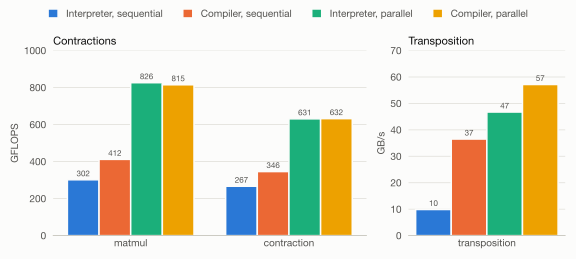
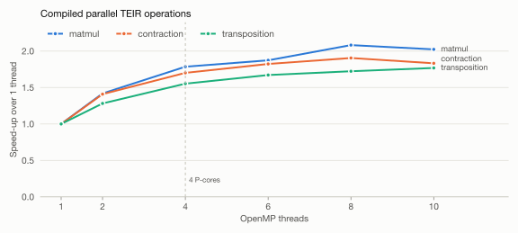

Week 7
===========

.. toctree::
   :maxdepth: 2

In the seventh week we implemented a runtime for the Tiled Execution Intermediate Representation (TEIR).

Lowering of Primitives
------------------------

The interpreter and the compiler share the decision how a primitive is executed (``teir_lowering.cpp``).
For every primitive with exactly one axis per dimension, ``teir_plan_tile`` selects a kernel of the code generator
and derives its parameters from the strides of the axes. The plan does not depend on the current iteration,
so it is computed once per primitive before the execution starts.

``Zero``, ``Copy`` and ``ReLU`` are executed by the ``Unary`` kernels.
Since these primitives are elementwise, both assignments of the ``M`` and ``N`` axes to the rows and columns of the kernel are tried.

.. list-table::
   :header-rows: 1

   * - Primitive
     - Condition on the unit-stride axes
     - Kernel
   * - ``Zero``
     - row axis of the output
     - ``zero``
   * - ``Copy``, ``ReLU``
     - row axis of input and output
     - ``identity`` / ``relu`` with ``trans_b = 0``
   * - ``Copy``, ``ReLU``
     - row axis of the input, column axis of the output
     - ``identity`` / ``relu`` with ``trans_b = 1``

``Contraction`` is executed by a ``Gemm`` kernel. The storage format of each matrix follows from its unit-stride axis:

.. list-table::
   :header-rows: 1

   * - Matrix
     - Unit stride along
     - Flag
     - Leading dimension
   * - A (``M`` × ``K``)
     - ``M`` / ``K``
     - ``trans_a = 0`` / ``1``
     - stride of ``K`` / ``M``
   * - B (``K`` × ``N``)
     - ``K`` / ``N``
     - ``trans_b = 0`` / ``1``
     - stride of ``N`` / ``K``
   * - C (``M`` × ``N``)
     - ``M`` / ``N``
     - ``trans_c = 0`` / ``1``
     - stride of ``N`` / ``M``

The generated kernels are stored in a ``UnaryCache`` and a ``GemmCache``, so a kernel is only generated once
for each combination of parameters. Primitives without axes (scalars) are executed directly by the interpreter
and by a few inline instructions in the compiled code. All other primitives raise an error.

In the example operations of ``teir/data`` all three tensors of the contractions are stored with the unit stride
along ``K`` for ``in0`` and along ``N`` for ``in1`` and ``out``. The plans therefore use ``trans_a = trans_b = trans_c = 1``.
In week 6 our generator reached about 470 GFLOPS for this storage format on one core, compared to 1800 GFLOPS
for the fastest format, because one operand has to be transposed inside the kernel.

TEIR Interpreter
------------------

The interpreter (``teir_interpreter.cpp``) executes an operation directly from its data structures.
It is created with the operation and the tensor pointers and is executed with ``run()``:

.. code-block:: c++

   teir_interpreter interpreter(operation, {in0.data(), in1.data(), out.data()});
   interpreter.run();

``run()`` first checks that every axis provides a stride and an offset for every tensor.
It then computes the plan of every primitive and generates the required kernels.
Afterwards the interpreter calls ``iterate`` for each root node of the schedule.

``iterate`` works recursively and carries two vectors from the root to the current node:
the ``axis_path`` holds the axes of all enclosing iteration nodes and the ``index_path`` their current indices.

* For an **iteration node** the interpreter checks the node's guards and loops over the extent of its axis.
  For every index it appends the axis and the index to the paths and calls ``iterate`` for all children in order.
* For an **invocation node** the interpreter checks the guards and executes the primitive.
  The address of every tensor is computed from the paths as

  .. math::

     \text{ptr}_t = \text{base}_t + \sum_{j} \left( \text{offset}_{j,t} + i_j \cdot \text{stride}_{j,t} \right),

  where :math:`j` runs over the axes of the path and :math:`i_j` is the index of axis :math:`j`.
  The pointers are passed to the kernel of the primitive together with the leading dimensions of its plan.
* A **guard** ``first(@x)`` or ``last(@x)`` is satisfied if every occurrence of the axis ``x`` in the path
  has the index :math:`0` or :math:`\text{extent} - 1`. A guard on an axis that is not part of the path is an error.

The interpreter resolves node, axis and primitive identifiers by their names during the iteration
and copies the paths for every child. This keeps the implementation close to the definition of TEIR,
but costs time for every invocation (see the benchmarks below).

Parallel Iteration Nodes
^^^^^^^^^^^^^^^^^^^^^^^^^^

An iteration node with the policy ``parallel`` distributes its iterations over OpenMP threads:

.. code-block:: c++

   #pragma omp parallel for schedule(dynamic)
   for (int64_t i = 0; i < extent; i++) {
       iterate_children(iter_node, axis, i, axis_path, index_path);
   }

Every iteration works on its own copies of the paths, and after the preparation in ``run()`` the iteration only reads
shared data. The kernel caches are additionally protected by a mutex.
``schedule(dynamic)`` balances the work between the P- and E-cores of the M4, which run at different speeds.
Parallel iteration nodes inside another parallel iteration node are executed sequentially by the thread
executing the outer iteration (``omp_in_parallel()``).
Exceptions are not allowed to leave an OpenMP region, so the first exception of the threads is caught and rethrown
after the loop.

Parallelizing an iteration node is only correct if the iterations write to different parts of the output.
Like the TEIR policy itself, the runtime does not check this.

TEIR compiler
------------------

The TEIR compiler converts a TEIR operation into a function of the signature ``void func(void**)`` using AArch64 assembly instructions.
This function accepts a pointer to an array of the addresses of the tensor memory areas in the register ``x0``
and performs the compiled operation on these tensors.

.. code-block:: c++

   teir_compiler compiler;
   compiler.compile(operation);
   std::vector<void*> tensors = {in0.data(), in1.data(), out.data()};
   compiler.get_function()(tensors.data());

Implementation
^^^^^^^^^^^^^^^^^^

The resulting function has the following general structure in pseudo-AArch64-assembly:

.. code-block:: none

    operation:
        // function prologue
        stp x29, x30, [sp, #-16]!
        mov x29, sp
        // ... save x19 - x28 and d8 - d15

        // general setup
        mov x28, x0
        mov x27, #<address of kernel_dispatch_table>

        // loop nest
        // ...

        // function epilogue
        // ... restore d8 - d15 and x19 - x28
        ldp x29, x30, [sp], #16
        ret

        // tensor shape data (extents, strides, offsets)
    shape_data:
        .quad #<extent01>
        .quad #<extent02>
        ...

This function makes use of the AArch64 registers as follows:

.. list-table::
    :header-rows: 1

    * - Registers
      - Usage
    * - ``x0`` through ``x7``
      - Scratch registers and parameter registers for JIT-kernels
    * - ``x19`` through ``x26``
      - Loop index registers
    * - ``x27``
      - Pointer to the kernel dispatch table
    * - ``x28``
      - Pointer to the tensor addresses
    * - ``d8`` through ``d15``
      - Saved and restored, since primitives may switch to streaming mode

The compiler generates the loop nest recursively, keeping track of the current index of each axis in the loop index registers.
Currently this limits the maximum loop depth to the number of these registers.
The loop index registers count down from the extent to 1, so a ``first`` guard compares the register to the extent
and a ``last`` guard compares it to 1.
The axis' strides and offsets will be applied by the corresponding loop, where offsets are added to the tensors before and strides inside the loop.
After the loop the offsets and total accumulated strides will be subtracted from the tensor pointers.

In order to load the extents, strides and offsets of the axes into registers at runtime, the compiler
appends all of the required data after the function in the executable memory area.

During the recursion over the nodes of the schedule, the compiler will encounter invocation nodes.
Before generating any code, the compiler computes the plan of every primitive, generates its kernel
and stores the function pointer in the ``kernel_dispatch_table``, whose address is held in ``x27``.
An invocation of a tile primitive loads the tensor pointers from ``x28`` into ``x0`` to ``x2``,
moves the leading dimensions of the plan as immediates into the following registers and branches to the kernel:

.. code-block:: none

    ldr x0, [x28, #<8 * index of in0>]
    ldr x1, [x28, #<8 * index of in1>]
    ldr x2, [x28, #<8 * index of out>]
    mov x3, #<ld_a>
    mov x4, #<ld_b>
    mov x5, #<ld_c>
    ldr x7, [x27, #<8 * index of primitive>]
    blr x7

Scalar primitives are executed by a few inline instructions instead.

The generated kernels switch into streaming mode with ``smstart`` and leave it with ``smstop``.
Both instructions set all vector registers to zero, including the lower halves ``d8`` to ``d15``, which a function
has to preserve according to the AArch64 procedure call standard.
While testing the parallel runtime we found that our ``Unary`` kernels did not save these registers.
After a kernel call, the calling C++ code continued with a zeroed ``double`` in ``d8``: in one test ``0 < 1e-5`` evaluated
to ``false``. The ``Unary`` kernels and the compiled functions now save ``d8`` to ``d15`` before switching modes,
and a test checks this for all ``Unary`` kernels and compiled functions.
The ``Gemm`` kernels already saved them.

Parallel Iteration Nodes
^^^^^^^^^^^^^^^^^^^^^^^^^^

The generated code can not contain OpenMP pragmas. Instead, the compiler generates a separate function for the loop body
of a parallel iteration node and calls the C++ function ``teir_compiler::parallel_for``, which executes the body in an
OpenMP loop:

1. **Collapsing.** If the only child of a parallel iteration node is another parallel iteration node without guards,
   both are merged into one parallel region with the product of the extents as iteration space.
   In the examples this merges ``m0`` and ``n0`` of ``matmul`` into 32768 iterations and ``p`` and ``r`` of ``contraction``
   into 12288 iterations, which gives the dynamic scheduling small enough work packages for ten threads.
2. **Body function.** The children of the innermost collapsed node are compiled into a new ``mini_jit::Kernel`` with
   the signature ``void body(void** tensors, uint64_t const* loop_indices)``. Its prologue moves the tensor pointers to
   ``x28``, loads all loop index registers from ``loop_indices`` and sets ``x27``. The children are generated with the
   usual recursion, so guards on axes outside of the region and nested sequential loops work unchanged.
3. **Call.** At the position of the parallel node, the enclosing code pushes the loop index registers ``x19`` to ``x26``
   onto the stack and calls ``parallel_for``:

   .. code-block:: none

       mov  x0, #<address of the parallel_region>
       mov  x1, x28                   // tensor pointers of the enclosing loops
       stp  x25, x26, [sp, #-16]!
       stp  x23, x24, [sp, #-16]!
       stp  x21, x22, [sp, #-16]!
       stp  x19, x20, [sp, #-16]!
       mov  x2, sp                    // loop indices of the enclosing loops
       mov  x7, #<address of parallel_for>
       blr  x7
       ldp  x19, x20, [sp], #16
       ...

4. **Execution.** ``parallel_for`` splits every flat iteration index into the indices of the collapsed axes.
   For every iteration it creates a private copy of the tensor pointers with the offsets and strides of the region's
   axes applied, extends the loop indices by the (count-down) indices of the region, and calls the body.
   Since every thread modifies only its private copy of the tensor pointers, the body can apply the strides of its inner
   loops in place like the sequential code does.

The ``parallel_region`` descriptors (body, extents, strides and offsets) and the body kernels are owned by the compiler,
so the compiled function is valid as long as the ``teir_compiler`` instance exists.
Like in the interpreter, the loop uses ``schedule(dynamic)`` and nested regions run sequentially.

Tests
------------------

The tests use Catch2 and are registered with CTest. Besides the existing tests of the interpreter
(``teir_interpreter_tests.out``) and the compiler (``teir_compiler_tests.out``), ``teir_runtime_tests.out`` covers the new features
with both runtimes:

* A batched GEMM with an outer sequential ``k0`` loop, a ``zero`` guarded by ``first(k0)`` and a sequential or parallel batch loop,
  for all eight storage formats of A, B and C, compared to a scalar reference. In the parallel version the guard refers to an axis
  outside of the parallel region.
* The transposition example (with smaller extents ``a`` and ``b``) with sequential and parallel policies, compared element by element.
* The matmul and contraction examples (with smaller extents) with the parallel policies of the files, interpreted and compiled,
  compared to the interpreter with sequential policies.
* The compiled functions preserve ``d8`` to ``d15``, sequential and parallel. ``code_gen/unary_tests.out`` contains the same test for the ``Unary`` kernels.

The operations are built by ``teir/teir_examples.hpp``, which derives the strides from the extents in the same way as the ``.teir`` files.
This allows the tests to use small extents and the benchmarks to use the extents of the files.

Benchmarks
------------------

``teir_benchmarks.out`` executes the three examples of ``teir/data`` with the extents of the files on the Apple M4
(4 P-cores, 6 E-cores). Every example runs in four configurations: interpreted and compiled, each with all iteration nodes
sequential and with the parallel policies of the file (10 OpenMP threads).
Before the measurement, each configuration runs once on the same inputs, and its output is compared to the output of the sequential interpreter.
All configurations produced bitwise identical results.
The table below shows the best of five runs; the median differs by less than 2 %.
All values are available :download:`as a table <data/week07_runtime.tsv>`.

    Performance of the TEIR runtime for the examples of ``teir/data``.

.. list-table::
   :header-rows: 1

   * - Example
     - Interpreter, sequential
     - Compiler, sequential
     - Interpreter, parallel
     - Compiler, parallel
   * - ``matmul`` (1.10 TFLOP)
     - 302 GFLOPS
     - 412 GFLOPS
     - 826 GFLOPS
     - 815 GFLOPS
   * - ``contraction`` (1.24 TFLOP)
     - 267 GFLOPS
     - 346 GFLOPS
     - 631 GFLOPS
     - 632 GFLOPS
   * - ``transposition`` (151 MB)
     - 9.9 GB/s
     - 36.5 GB/s
     - 46.7 GB/s
     - 57.2 GB/s

For the transposition the bandwidth counts every element once for reading and once for writing.

Interpreter and Compiler
^^^^^^^^^^^^^^^^^^^^^^^^^^

With sequential policies the compiled functions are 1.3 to 3.7 times faster than the interpreter.
The difference is the time the interpreter spends outside of the kernels for every invocation:
about 1.9 µs for the 524288 GEMM invocations of ``matmul`` (0.98 s),
2.6 µs for the 405504 invocations of ``contraction`` (1.06 s)
and 0.9 µs for the 12288 copies of ``transposition``.
The transposition kernels only copy a 48 × 32 block of 6 KiB, so the overhead dominates and the compiler is 3.7 times faster.

With parallel policies interpreter and compiler reach the same performance for the contractions.
The kernels run on the SME units, while the overhead of the interpreter runs on the regular cores.
Since the M4 has more cores than SME units (see below), this overhead is hidden.
The transposition still benefits from the compiler (57 vs. 47 GB/s).

The sequential compiled contractions reach 412 and 346 GFLOPS, which is close to the 470 GFLOPS
of our generator for this storage format in week 6. We assume the remaining gap comes from the smaller kernels
(e.g. 32 × 64 × 512 for ``matmul`` instead of 512 × 512 × 512), which amortize the loads and stores of C and the setup of the kernel
over fewer operations.

Parallelization
^^^^^^^^^^^^^^^^^^

The parallel policies speed up the compiled contractions by a factor of 2.0 (``matmul``) and 1.8 (``contraction``)
and the transposition by a factor of 1.6 compared to the sequential compiled code.
To find out where this limit comes from, we executed the compiled parallel configurations with 1 to 10 OpenMP threads
(best of three runs, 20 for the transposition,
:download:`as a table <data/week07_scaling.tsv>`).

    Speed-up of the compiled parallel operations over the same function executed with one thread.

.. list-table::
   :header-rows: 1

   * - Threads
     - 1
     - 2
     - 4
     - 6
     - 8
     - 10
   * - ``matmul`` [GFLOPS]
     - 406
     - 577
     - 726
     - 761
     - 846
     - 822
   * - ``contraction`` [GFLOPS]
     - 345
     - 486
     - 587
     - 629
     - 658
     - 632
   * - ``transposition`` [GB/s]
     - 33
     - 42
     - 51
     - 55
     - 57
     - 58

The speed-up grows quickly up to four threads and levels off at about 2, far below the ten cores of the M4.
We attribute this to the SME units: the M4 does not have one SME unit per core, but one per CPU cluster,
which is shared by all cores of the cluster (one for the four P-cores and one for the six E-cores).
All threads of a cluster therefore compete for the same unit, and additional threads mainly help to keep
the units busy while other threads are in the scalar parts of the code.
macOS does not allow pinning threads to cores, so we can not tell which cluster a thread runs on,
and the small drop from 8 to 10 threads for the contractions is within what we would expect from this uncontrolled placement.

The transposition moves 151 MB per run. Its kernels spend a larger fraction of the time on loads and stores,
so the speed-up is additionally limited by the memory bandwidth.

Notes on the Example Files
^^^^^^^^^^^^^^^^^^^^^^^^^^^^

* The output strides of ``transposition.teir`` for ``b`` (17664) and ``d`` (2260992) correspond to 92 instead of 96 blocks of ``a``.
  With these strides different iterations write the same output elements. We use the dense strides of the
  :math:`dbac` output (18432 and 2359296), which makes the result a real transposition and allows a parallel execution.
* In ``matmul.teir`` the ``zero`` invocation is a child of ``iter_k0`` and has no output stride along ``k0``.
  It therefore zeroes only the first 32 × 64 block of the output, once per ``k0`` iteration.
  We kept the schedule as given; the verification compares all configurations to the interpreter
  instead of to a plain matrix product.
