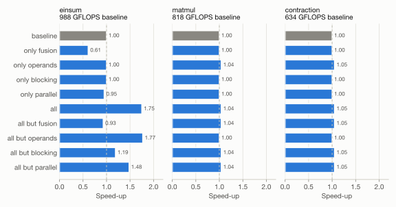

Week 8
===========

.. toctree::
   :maxdepth: 2

In the eighth week we implemented transformations of TEIR operations and used them to build optimization passes.
We evaluated the passes in an ablation study on the ``matmul`` and ``contraction`` examples of ``teir/data`` and on the einsum
:math:`acspx,bspy \rightarrow abcyx` with the extents :math:`(4, 4, 3, 64, 64, 1536, 1152)`.
With all passes the einsum runs 1.75 times faster than its baseline, the two example files 1.04 and 1.05 times faster.

The source code is located in ``teir/teir_transform.cpp`` (transformations), ``teir/teir_passes.cpp`` (passes)
and ``teir/teir_ablation.cpp`` (ablation study). All measurements were taken on the Apple M4 with the compiled runtime of week 7.

Transformations
------------------

Every transformation returns a transformed copy of the operation. It checks the conditions under which the result of
the operation stays the same and throws a ``teir_transform_error`` otherwise, so the passes can simply try a transformation.
In the conditions below, the *written tensor* of a primitive is its last tensor, and an axis is a *reduction axis* of a subtree
if a tensor written in the subtree has the stride 0 along the axis. Our guards refer to axes, not nodes.

.. list-table::
   :header-rows: 1
   :widths: 18 45 37

   * - Transformation
     - Effect
     - Conditions
   * - ``teir_split(op, a, f)``
     - Replaces the axis :math:`a` by an outer axis :math:`a_o` (extent :math:`e/f`, strides :math:`f \cdot s`) and an inner axis :math:`a_i` (extent :math:`f`).
       An iteration node over :math:`a` becomes a node over :math:`a_o` with a single child over :math:`a_i`.
       If :math:`a` is a primitive axis, the primitives use :math:`a_i` and every run of consecutive invocations of them is wrapped into a new loop over :math:`a_o`.
       Guards ``first(a)`` become ``first(a_o), first(a_i)``, ``last`` likewise.
     - :math:`f` divides the extent, :math:`1 < f < e`.
   * - ``teir_fuse(op, o, i)``
     - Merges two axes into one axis of extent :math:`e_o e_i` with the strides of :math:`i`: either a node over :math:`o` with its only child over :math:`i`,
       or the consecutive entries :math:`[o, i]` of a primitive dimension. ``first(o), first(i)`` becomes ``first(oi)``.
     - :math:`s_o = e_i \cdot s_i` for every tensor, no offsets on :math:`i`, no guard on only one of the axes.
   * - ``teir_promote(op, n, dim)``
     - Removes the iteration node :math:`n` and prepends its axis to the dimension ``M``, ``N`` or ``K`` of the primitives invoked below it.
     - All children are invocations. Children not accessing the axis must be guarded by ``first`` (and precede the users) or ``last`` (and follow them); they are then executed once.
       For contractions the dimension must match the strides (``K``: read by both inputs, not written).
   * - ``teir_reorder(op, n)``
     - Interchanges the node :math:`n` with its only child.
     - The child is an iteration node without guards. Not both axes are reduction axes, since otherwise the order of the contributions to an output element would change.
   * - ``teir_set_policy(op, n, p)``
     - Sets the policy of the node :math:`n`.
     - ``parallel`` only for axes that are not reduction axes of the subtree.
   * - ``teir_swap_operands(op, prim)``
     - Swaps the inputs of a contraction together with its ``M`` and ``N`` axes: :math:`C^T = B^T A^T`.
     - Contraction primitive.

The last transformation is not part of the list in the task. It does not change the loops, but the storage formats the GEMM kernel sees:
a row-major C becomes column-major. ``teir_to_string`` prints an operation in the TEIR text format, which we used for the listings below.

Target Parameters
------------------

The passes are configured by a ``teir_target``, which ``teir_target::host()`` reads from the machine:

.. list-table::
   :header-rows: 1

   * - Parameter
     - Value on the M4
     - Source
     - Used for
   * - L1 data cache of a P-core
     - 128 KiB
     - ``sysctl hw.perflevel0.l1dcachesize``
     - K block size
   * - L2 cache of the P-cluster
     - 16 MiB
     - ``sysctl hw.perflevel0.l2cachesize``
     - M and N block sizes
   * - Cores sharing the L2 cache
     - 4
     - ``sysctl hw.perflevel0.cpusperl2``
     - L2 share per thread
   * - Threads
     - 10 (4 P- and 6 E-cores)
     - ``omp_get_max_threads()``
     - Parallel iterations
   * - Streaming vector length
     - 64 bytes
     - ``rdsvl``
     - Microkernel: :math:`2 \times 2` ZA tiles of :math:`16 \times 16`, i.e. :math:`32 \times 32`

The E-cores have a 64 KiB L1 and a 4 MiB L2 cache. We use the P-core values, since the P-cluster's SME unit does most of the work.
The size of the system level cache is not exposed by macOS, and we do not use it.

Optimization Passes
--------------------

We implemented four passes. ``teir_optimize`` applies the selected passes in the order below.

1. **Primitive fusion.** For every contraction invocation, the pass promotes the enclosing iteration node into the primitive dimension its axis belongs to (M, N or K)
   and fuses it with the axis already in that dimension. This is repeated until no loop can be moved, since our GEMM kernels support one axis per dimension.
2. **Operand order.** If the plan of a contraction passes C to the kernel in row-major format, the pass swaps the operands.
   The generator is faster with a column-major C. For the 32 × 64 × 512 tiles of ``matmul`` a single kernel reaches 483 instead of 388 GFLOPS,
   while the 96 × 64 × 256 tiles of ``contraction`` run at the same speed in both formats (476 and 473 GFLOPS).
3. **Cache blocking.** The pass splits the M, N and K axes of a GEMM primitive and creates the loops :math:`M_o \rightarrow N_o \rightarrow K_o` around it.

   * K blocks are at most :math:`L1 / 2 / (4 \cdot 32) = 512` values, so the 32-row strip of A used by one microkernel call over the whole K block fills at most half of the L1 cache.
   * M and N blocks are multiples of 32 (or the full extent). The pass takes the largest block of C for which the blocks of A, B and C fit into the budget:
     the whole L2 cache (16 MiB) for sequential execution, or the share of one core (4 MiB) if the parallelization pass is enabled.
4. **Parallelization.** Starting at each root, the pass skips reduction loops and sets the policy ``parallel`` on the following chain of non-reduction loops,
   until their combined iteration count reaches :math:`8 \cdot \text{threads} = 80`. The runtime collapses these loops into one parallel region.
   The factor 8 leaves the dynamic scheduling enough iterations to balance the P- and E-cores.

We derived the blocking rule from measurements of the einsum with different block sizes (after primitive fusion, K = 4096).
The working set is the size of the A, B and C blocks:

.. list-table::
   :header-rows: 1

   * - Blocks M × N × K
     - Working set
     - Sequential
     - Parallel (a, b, c)
   * - 1536 × 1152 × 4096 (no blocking)
     - 48.8 MiB
     - 584 GFLOPS
     -
   * - 1536 × 1152 × 512
     - 12.0 MiB
     - **1445 GFLOPS**
     - 1324 GFLOPS
   * - 1536 × 1152 × 256
     - 9.4 MiB
     - 1427 GFLOPS
     - 1363 GFLOPS
   * - 1536 × 1152 × 64
     - 7.4 MiB
     - 986 GFLOPS
     - 933 GFLOPS
   * - 512 × 576 × 512
     - 3.3 MiB
     - 1389 GFLOPS
     - 1707 GFLOPS
   * - 512 × 384 × 512
     - 2.5 MiB
     - 1383 GFLOPS
     - **1774 GFLOPS**
   * - 256 × 288 × 512
     - 1.3 MiB
     - 1267 GFLOPS
     - 1738 GFLOPS
   * - 128 × 128 × 512
     - 0.6 MiB
     - 1136 GFLOPS
     -

Sequentially, the best blocks keep the full M and N extents and only split K, as long as the working set fits into the 16 MiB L2 cache.
In parallel, the blocks have to fit into a quarter of the L2 cache. The rule selects 1536 × 1152 × 512 for sequential and 512 × 576 × 512 for parallel execution,
which are within 4 % of the best measured blocks.

Moving reduction loops inward is a common optimization we tested but did not keep: interchanging ``k0`` of ``matmul`` below ``m0`` and ``n0``
keeps each output block in the cache over all 16 ``k0`` iterations, but reduced the performance from 883 to 769 GFLOPS.
With ``k0`` outermost, consecutive parallel iterations share their blocks of ``in0`` and ``in1``, which is lost after the interchange.

Baselines
------------------

The unoptimized operations are executed with the compiled runtime of week 7 and the policies of their definitions:

* ``contraction``: ``contraction.teir`` as given (``p`` and ``r`` parallel).
* ``matmul``: ``matmul.teir`` with one change. In the file, ``inv_zero`` is a child of ``iter_k0`` and has no output stride along ``k0``,
  so it only zeroes the first 32 × 64 output block in every ``k0`` iteration. This also prevents any reordering of ``k0``.
  Our baseline invokes ``zero`` guarded by ``first(k0)`` as the first child of ``iter_n0``, which zeroes every output block before its first contribution
  and computes the product :math:`mk,kn \rightarrow mn`. The loops and policies are unchanged, and both versions run at the same speed (814 and 818 GFLOPS).
* ``einsum``: There is no TEIR file for the einsum. We wrote the baseline in the style of the example files: the unit-stride axes :math:`x` (M) and :math:`y` (N)
  and the innermost contraction axis :math:`p` (K) form the GEMM primitive, all other axes are iterated sequentially:

.. code-block:: none

   teir @einsum {
     tensor %in0 : f32
     tensor %in1 : f32
     tensor %out : f32

     axis @a extent 4 strides { in0: 75497472, out: 84934656 }
     axis @b extent 4 strides { in1: 18874368, out: 21233664 }
     axis @c extent 3 strides { in0: 25165824, out: 7077888 }
     axis @s extent 64 strides { in0: 393216, in1: 294912 }
     axis @p extent 64 strides { in0: 6144, in1: 4608 }
     axis @x extent 1536 strides { in0: 4, out: 4 }
     axis @y extent 1152 strides { in1: 4, out: 6144 }

     primitive @zero : Zero axes { M: [@x], N: [@y] }
     primitive @gemm : Contraction axes { M: [@x], N: [@y], K: [@p] }

     schedule {
       roots [@iter_a]
       iter @iter_a axis @a policy sequential children [@iter_b]
         iter @iter_b axis @b policy sequential children [@iter_c]
           iter @iter_c axis @c policy sequential children [@iter_s]
             iter @iter_s axis @s policy sequential children [@inv_zero, @inv_gemm]
               invoke @inv_zero primitive @zero  guard first(@s)
               invoke @inv_gemm primitive @gemm
     }
   }

Ablation Study
------------------

For every operation we measured the baseline, each pass on its own, all passes, and all passes except one (``teir_ablation.out all 5``).
Each configuration was compiled, executed once to compare its output to the baseline's, and then timed five times; the tables show the best run.
**All configurations produced bitwise identical results to their baseline.** The unit tests additionally compare all 16 combinations of passes
to a reference implementation of the einsum and to the unoptimized ``matmul`` and ``contraction`` at smaller extents.
The results are available :download:`as a table <data/week08_ablation.tsv>`.

    Speed-up of each configuration over the unoptimized baseline.

.. list-table::
   :header-rows: 1

   * - Operation
     - FLOP
     - Baseline
     - All passes
     - Speed-up
   * - ``einsum``
     - 0.70 T
     - 988 GFLOPS
     - 1733 GFLOPS
     - 1.75
   * - ``matmul``
     - 1.10 T
     - 818 GFLOPS
     - 851 GFLOPS
     - 1.04
   * - ``contraction``
     - 1.24 T
     - 634 GFLOPS
     - 666 GFLOPS
     - 1.05

Repeated runs of the same schedule differ by up to 1 to 2 % (``all`` and ``all but operands`` produce the same einsum schedule and reached 1.75 and 1.77).

Einsum
^^^^^^^^^^^^^^^^^^

All passes turn the baseline into the following schedule:

.. code-block:: none

   fusion: promoted @iter_s into K of @gemm, fused @s and @p
   blocking: @gemm 1536 x 1152 x 4096 -> blocks 512 x 576 x 512
   parallel: @iter_a, @iter_b, @iter_c, @iter_x_o (144 iterations)

   primitive @zero : Zero axes { M: [@x_i], N: [@y_i] }
   primitive @gemm : Contraction axes { M: [@x_i], N: [@y_i], K: [@sp_i] }

   schedule {
     roots [@iter_a]
     iter @iter_a axis @a policy parallel   children [@iter_b]
       iter @iter_b axis @b policy parallel   children [@iter_c]
         iter @iter_c axis @c policy parallel   children [@iter_x_o]
           iter @iter_x_o axis @x_o policy parallel   children [@iter_y_o]
             iter @iter_y_o axis @y_o policy sequential children [@inv_zero, @iter_sp_o]
               invoke @inv_zero primitive @zero
               iter @iter_sp_o axis @sp_o policy sequential children [@inv_gemm]
                 invoke @inv_gemm primitive @gemm
   }

The passes depend on each other, which the ablation shows clearly:

* **Fusion alone slows the einsum down (0.61).** A single GEMM with K = 4096 over the full 1536 × 1152 output streams 48.8 MiB per call through the caches.
  Its benefit only appears together with blocking: without fusion, all other passes reach 0.93, with it 1.75.
* **Blocking alone does nothing**, since the baseline kernel (K = 64) already fits into the L2 cache. It is required after fusion: without blocking the speed-up drops from 1.75 to 1.19.
* **Parallelization alone slows the einsum down (0.95).** Ten threads with unblocked 7.4 MiB working sets compete for the L2 caches.
  With blocking it adds 18 % (1.48 without it, 1.75 with it).
* **Operand order** does not apply, since C is already column-major.

Matmul and Contraction
^^^^^^^^^^^^^^^^^^^^^^^

For the two example files only the operand order pass has an effect (4 and 5 %):

* No loop can be fused into the primitives. For example, ``k0`` of ``matmul`` has the stride 65536 in ``in0`` but would need :math:`512 \cdot 4 = 2048`.
* The primitives are already small (32 × 64 × 512 and 96 × 64 × 256), so the blocking pass does not split them.
* The files already parallelize the right loops. To check that the parallelization pass finds them, we also optimized versions of the files with all policies set to sequential:

.. list-table::
   :header-rows: 1

   * - Operation
     - Sequential policies
     - Sequential policies + all passes
     - File policies (baseline)
   * - ``matmul``
     - 412 GFLOPS
     - 867 GFLOPS
     - 818 GFLOPS
   * - ``contraction``
     - 348 GFLOPS
     - 662 GFLOPS
     - 634 GFLOPS

The pass parallelizes ``m0`` of ``matmul`` (256 iterations) and ``p`` of ``contraction`` (128 iterations) and reaches the performance of the files.

The main limitation of these two operations is their data layout. ``in0`` of both operations has its unit stride along the contraction axis,
so the GEMM kernels have to transpose one operand, which costs about three quarters of the performance:
the same 32 × 64 × 512 kernel with the fast storage formats reaches 1906 instead of 483 GFLOPS.
Transposing ``in0`` once into a temporary tensor (packing) would avoid this, but requires an additional tensor, which the TEIR transformations of the task can not introduce.
The second limitation is the hardware: the M4 shares one SME unit between all cores of a cluster (see week 7), so the parallel speed-up of all operations stays around two.

Tests
------------------

``teir_optimization_tests.out`` contains the tests of the transformations and passes:

* Each transformation preserves the result of the operation it is applied to (interpreted or compiled), including the translation of guards by ``split``,
  the wrapping of invocations for split primitive axes, and ``fuse`` as the inverse of ``split``.
* Transformations whose conditions are violated throw, e.g. parallel reduction loops, interchanged reduction loops, or promoting a loop whose other children are not guarded.
* All 16 combinations of passes applied to a small einsum match the reference implementation. A target with small caches forces the passes to split all three dimensions.
* All passes preserve smaller versions of ``matmul`` and ``contraction``.
